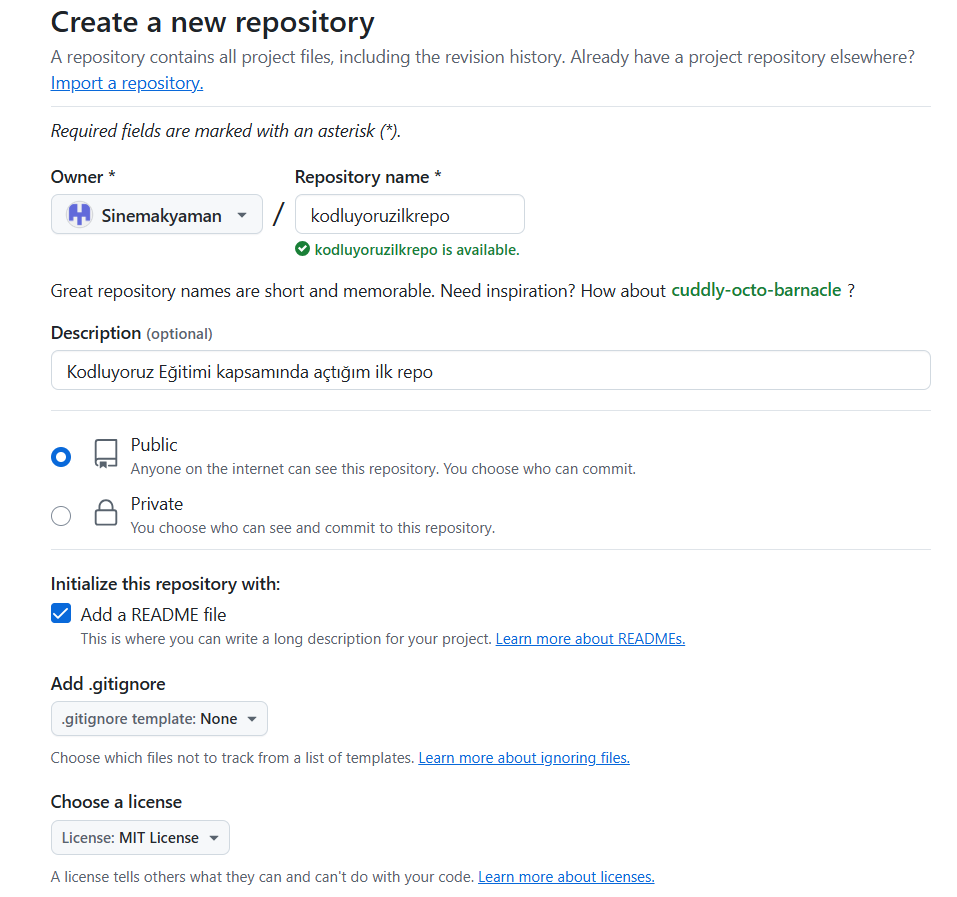

# Kodluyoruz İlk Repo 

Bu repo [Kodluyoruz](Front-End) Eğitiminde oluşturduğumuz ilk repo, içerisinde bir adet README dosyası bir adet de index.html barındırıyor.

--------------------------------------------------------------

<!-- /code_chunk_output -->


***


## Installatİon 

Öncelikle projeyi klonlayın.(Buraya sizin reponuzdan aldığınız link gelecek )

```git clone https://github.com/Sinemakyaman/kodluyoruzilkrepo.git```

## Usage 
Projeyi klonladıktan sonra Visual Studio Code programında açınız.

```Linux için: (cd kodluyoruzilkrepo code . )```

## Contributing

Pull requestler kadul edilir.Büyük değişiklikler için lütfen önce neyi değiştirmek istediğinizi tartışmak için bir konu açınız. 

## License 

[MIT](https://choosealicense.com/licenses/mit/)

